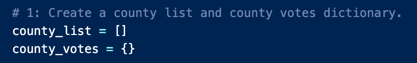
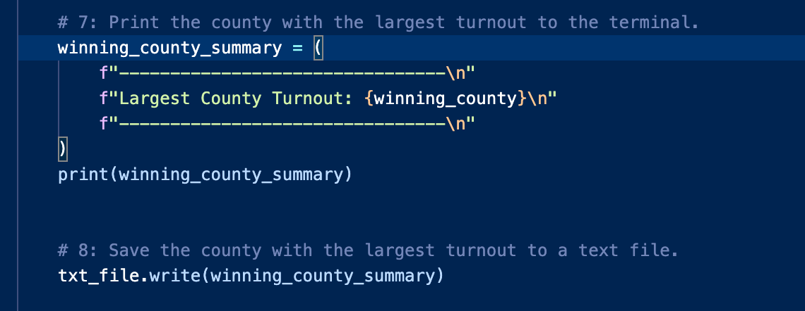

# Election Analysis
Automating election results
## Overview of Election Audit
The overview of this election audit was to create a new way of analyzing voting data for a congressional election in Colorado. The goal was to create a Python script to determine the winner of the election that can also be used in other districts and for the senate elections. The files used are listed below.  
Election data:   
Python script:   
Analysis:   
## Election Audit Results
* Total number of votes cast in the election: 369,711  
* County breakdown and percentages:   
  * Jefferson: 10.5% (38,855)  
  * Denver: 82.8% (306,055)  
  * Arapahoe: 6.7% (24,801) 
* County with most votes: Denver  
* Breakdown of votes and percentages by candidate: 
  * Charles Casper Stockham: 23.0% (85,213)  
  * Diana DeGette: 73.8% (272,892)  
  * Raymon Anthony Doane: 3.1% (11,606)  
* Winning candidate, percentage, and number of votes: Diana DeGette: 73.8% (272,892)  
## Election Audit Summary
This script can be used in any election with the modification of some variable names but with the format and logic of the code remaining the same. For example, the inital naming of the list and dictionary used to store the number of votes for each county can be changed to hold different values, like the number of votes for each county in a different district. This is done by creating a list to be paired with data that will be stored in a dictrionary. The code is shown here:   
   
Another example of code that can be changed to fit another election is printing the results and saving them to another file. The code can be modified by changing the variable names but keeping the format the same. The code for this election is shown here:  

